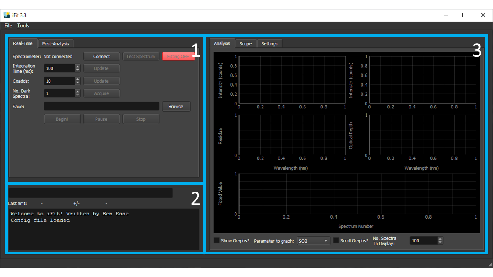
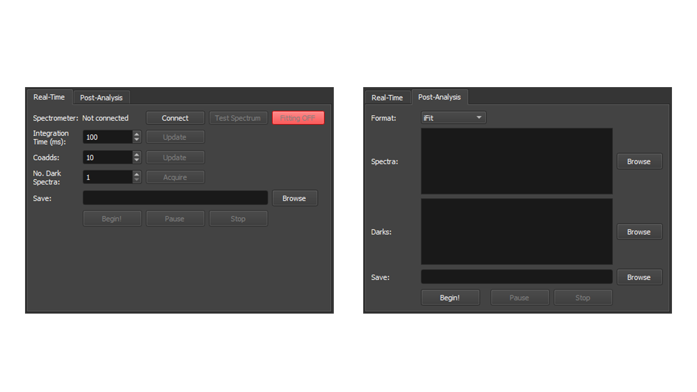
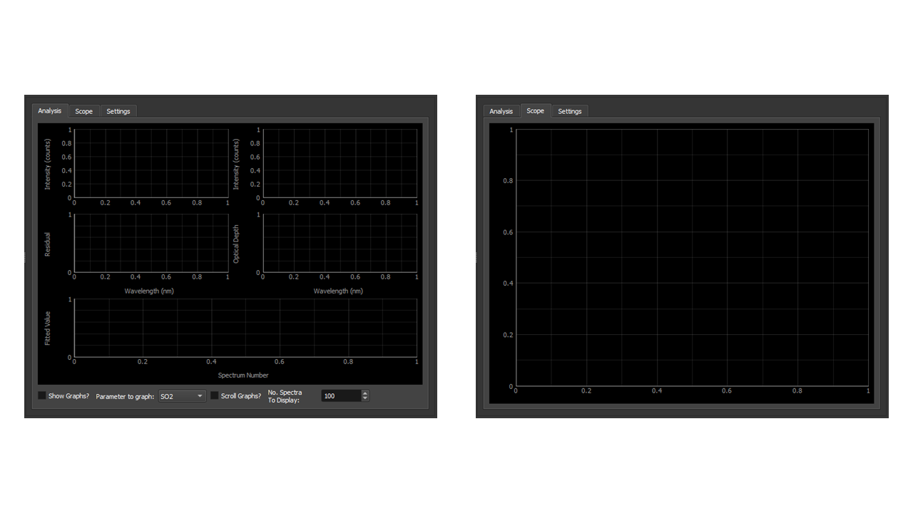
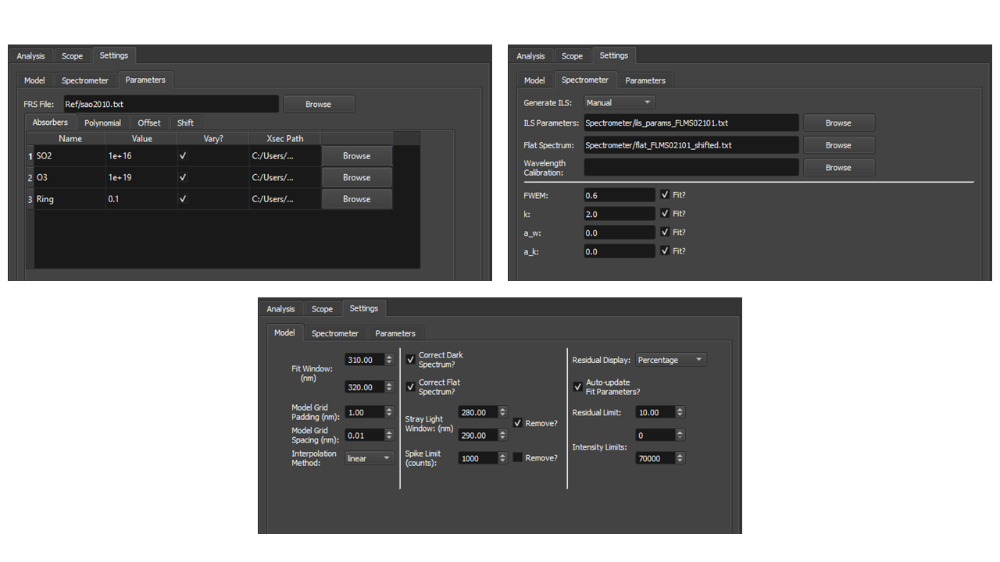

# iFit User Interface

To avoid the need to write a script for every use a Graphical User Interface (GUI) was developed for iFit. This also helps to facilitate spectra acquisition and real-time analysis. This section will outline the setup and use of the GUI for both real-time and post analysis. This will apply for running the GUI with Python or from an executable file.

# GUI Overview

When the GUI is launched the user is presented with the screen shown in Fig. 1.

This has three main sections:
- Program Controls
- Program Outputs
- Graphs and Settings

Figure 1: The main GUI interface

# Program Controls

The program controls are slit into two tabs, Real-Time and Post-Analysis (Fig. 2). As suggested by the names, the Real-Time tab handles spectra acquisition and real-time analysis, while the Post-Analysis allows the processing of already acquired data.

Figure 2: GUI controls

Real-Time Controls
------------------

| **Item** | **Description** |
| -------- | --------------- |
| Spectrometer | Displays the serial number of the connected spectrometer. Connect/Disconnect to the spectrometer by clicking `Connect` |
| Test Spectrum | Reads a single spectrum to test the connection and acquisition settings. This spectrum is not saved but displayed on the `Scope` plot |
| Fitting ON/OFF | Toggles real time analysis of spectra as they are recorded |
| Integration Time (ms) | The integration time of each individual spectrum in ms. Use the `Update` button to push to the spectrometer |
| Coadds | Number of individual spectra to average to form a measurement. Note that averaging is done in software not onboard the spectrometer. Use the `Update` button to push to the spectrometer |
| No. Dark Spectra | The number of dark spectra to record. Begin acquisition of dark spectra by clicking the `Acquire` button. Dark spectra are saved to a subdirectory in the save folder called `Dark`. Note that each read creates a new folder (numbered sequentially) |
| Output Folder | Path to the folder to contain the measurement results. This includes measurement spectra (stored under `/save/path/spectra/)`, dark spectra (stored under `/save/path/spectra/dark`) and analysis outputs |
| Begin! | Launches continuous spectra acquisition (and simultaneous analysis if `Fitting ON`) |
| Pause | Pauses the acquisition/analysis |
| Stop | Ends the acquisition/analysis |

## Post-Analysis

| **Item** | **Description** |
| -------- | --------------- |
| Format | Format of the spectra files to read |
| Spectra | Measurement spectra files. Can be selected using a File Dialogue with `Browse` |
| Darks | Dark spectra files. Can be selected using a File Dialogue with `Browse` |
| Output File | Location to save the output `.csv` file to |
| Begin! | Launches spectra analysis |
| Pause | Paused the analysis |
| Stop | Ends the analysis |

# Program Outputs

This frame contains a progress bar and text box to display program progress and any info or error messages.

## Graphical Display

This frame contains the graphical output of the program. The `Analysis` tab shows the results of spectral fits, while the `Scope` tab shows the acquired spectra.

igure 3: GUI graphical outputs

The bottom of the `Analysis` tab has a number of options for the graphs.

| **Item** | **Description** |
| -------- | --------------- |
| Show Graphs? | Toggles whether graphs are plotted or not. Plotting graphs requires some computational resources so analysis can slow as a result. This impact is lessened if the limits of the graphs are fixed (this can be done by hand) |
| Parameter to graph | Sets the parameter to display in the optical depth and parameter plots. These display the synthetic and measured optical depths, and the fitted parameter value respectively. |
| Scroll Graphs? | Toggles whether the bottom graph scrolls or not. If not then all data points are show, which can significantly slow down the program if the number is large. Other wise the number of spectra to display is given in the `No. Spectra To Display` option |

## Program Settings

The final tab contains the program settings. These include the fit window and quality controls, any spectral pre-processing steps required and the parameters to include in the fit.

Figure 4: GUI settings

The settings are split into three tabs:

### Model

| **Item** | **Description** |
| -------- | --------------- |
| Fit Window | The wavelength window in which o perform the fit |
| Model Grid Padding | The amount to pad the model grid in order to avoid edge effects from the ILS convolution |
| Model Grid Spacing | The spacing on which the model grid is formed |
| Interpolation method | The method to use in each iteration of the model fit to interpolate the model spectrum onto the spectrometer wavelength grid. `cubic` is more accurate but `linear` is faster and more stable |
| Correct Dark Spectrum? | Controls whether the dark spectrum is subtracted from the measured spectrum during the spectrum pre-processing step |
| Correct Flat Spectrum? | Controls whether the flat-field spectrum is removed from the measured spectrum during the spectrum pre-processing step |
| Stray Light Window | The wavelength window over which to average the stray-light intensity. This is subtracted from the measured spectrum in the pre-processing step if the `Remove` checkbox is selected |
| Spike Limit | Sets the limit at which to remove hot or dead pixels. Defined as the intensity change between neighbouring pixels |
| Residual Display | Controls how to display the residual, either as a percentage of the measured signal or in absolute intensity units |
| Auto-Update Fit Parameters | Controls whether the first guess fit parameters used are updated with the previous fit's optimised parameters. This speeds up analysis, but can lead to the fit getting stuck in a local minimum, especially for poor quality data |
| Residual Limit | Sets the maximum value the residual can be to be classed as a good fit. Bad fits also reset the first guess parameters if Auto-Update Fit Parameters is on. Note this value should be changed if switching between Percentage and Absolute residual display |
| Intensity Limit | Sets the limits on intensity in the fit window for which the fit can be considered good. Bad fits also reset the first guess parameters if Auto-Update Fit Parameters is on |

### Spectrometer

| **Item** | **Description** |
| -------- | --------------- |
| Generate ILS | Controls how the instrument line shape is handled. `Params` uses fixed parameters read from a text file defined at `ILS Parameters`. These should be the FWEM, k, a\ :sub:`w` and a\ :sub:`k` values respectively, each on a new line. `File` uses a directly measured lineshape read from `ILS Parameters`. `Manual` uses the parameters given in this tab, with the option to fit them if desired. |
| ILS Parameters | File the contains either the ILS super-Gaussian parameters or the directly measured lineshape to use |
| Flat Spectrum | Path to the flat spectrum to use. Should be a file with two columns delimited with a tab. The first is intensity and the second is the flat-field response |
| Wavelength Calibration | The wavelength calibration to use if none are given in the spectra files |
| FWEM, k, aw, ak | The super-Gaussian parameters to use if `Generate ILS` is set to `Manual`. These parameters can also be fitted if desired. |

### Parameters

This tab sets up the fit `Parameters` through a series of tables. For each table rows can be added or removed by right-clicking on the table.

The `Absorbers` table controls the absorbing species included in the fit, such as gases and Ring. Each absorber `Parameter` has a `name` (which must be unique), a `value`, a control on whether it is fitted or fixed and a file from which to read the cross-section. The cross-section file should have two columns, one for the wavelength and one for the cross-section efficiency.

The `Polynomial`, `Offset` and `Shift` tables control the polynomial parameters for the fitted background polynomial, intensity offset and wavelength shift/stretch included in the fit.