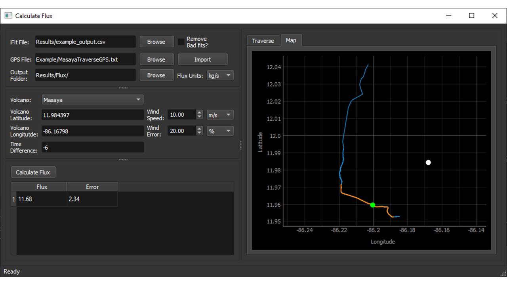

[Home](index.md) | [Theory](theory.md) | [Software](software.md) | [Tools](tools.md)

# iFit GUI Tools

iFit comes with a number of useful tools to aid with analysis. These are:

- ILS tool
- Flat-field tool
- Calc-Flux tool

These can be found under the `Tools` menu in the main iFit GUI.

# ILS Tool

The ILS tool is useful for parameterising the Instrument Line Shape (ILS) of a spectrometer using a Hg lamp. This section will describe how to use this tool.

  Figure 1: ILS Tool Window

In order to parameterise the spectrometer ILS, first use the main iFit GUI to acquire spectra of a Hg lamp, ensuring that the target line does not saturate the detector. It is also good practice to acquire dark spectra at the same time.

Next, use the ILS tool to read in the measured spectra. You can select the raw Hg spectra using the `Spectra` input and the dark spectra using the `Dark Spectra` input. Then import the spectra using the `Import` button. The program will then read and average the Hg and dark spectra and display the dark-corrected Hg spectrum in the top graph panel.

Figure 2: ILS Tool Graphs

Now use the blue highlighted region to select the desired line. For typical iFit analysis it is suggested to use the 302 nm line, as this is the closest singlet to the default analysis region (310 - 320 nm).

Once the line is selected, press `Fit` to fit a super-Gaussian lineshape to that line. The normalised line and fit are displayed on the lower graph panel. If you are happy with the fit then enter the file name in the `Save` input (for example [spec_serial_no]_ils_params.txt) and the fitted super-Gaussian parameters will be written to this file.

# Flat-Field Tool

The Flat-Field tool works in a very similar way to the ILS tool. First measure spectra from a broadband light source. To remove any contribution of noise it is suggested to use a high number of coadds (e.g. 10,000) to measure this spectrum. Dark spectra should also be acquired.

Figure 3: Flat Tool Window

Now load these with the Flat-Field tool using the `Spectra` and `Dark Spectra` inputs. When the `Import` button is pressed the dark-corrected broadband spectrum should be displayed in the top graph panel. Use the blue highlighted region to select the wavelength range to use, then press `Fit`.

Figure 4: Flat Tool Graphs

The measured and smoothed broadband spectrum are then displayed on the middle graph panel, with the resulting flat spectrum on the bottom. If you are happy with the flat spectrum then enter the desired file name into the `Save` input (e.g. [spec_serial_no]_flat.txt) and press `Save` to record the flat-field spectrum.

# Calc-Flux Tool

This tool can be used to calculate SO2 fluxes from traverse measurements. This tool takes the iFit output file along with a simultaneous GPS track to calculate a plume cross-section, which is converted to a flux using knowledge of the source location and the wind speed.

.. note:: The use of the term "flux" here really refers to an emission rate ([quantity]·[time]−1) rather than the strict definition of a flux ([quantity]·[time]−1·[area]−1). We maintain this terminology as it is commonplace in volcanological literature.

The user is greeted by this window:

Figure 5: The Calc Flux window

There are four main sections:
- Data import
- Volcano and Wind settings
 - Outputs
 - Graphs

## Data Import

Here the user defines the iFit results file, GPS file and Output Folder to hold the output results. There is also an option to ignore "bad" fits, defined as any successful iFit fit that failed either the residual or intensity checks (and so has a `fit_quality` of 2). The user can also set whether the fluxes are calculated in ks/s or tons/day. Finally the data is imported by clicking `Import`.

**_NOTE:_** Currently calc_flux requires that the SO2 SCD parameter is called "SO2" in the iFit output file.

**_NOTE:_** The GPS data is assumed to be tab delimited and that it includes the following headings (case sensitive): "time", "latitude", "longitude" and "altitude (m)". Other headings may be included in the file, but these are ignored.

## Volcano and Wind Settings

This section sets up the volcano location and the wind speed used to calculate the flux. The volcano data can either be input manually or selected from pre-saved data stored in the `bin/volcano_data.yml` file. New volcanoes can be added to this file using the YAML format. Each entry is just a list, for example:

    Masaya:
    - 11.984397
    - -86.167980
    - -6

Where the entries are the volcano latitude, longitude and time difference respectively. The time difference is used as typically spectra are recorded using local time, whilst GPS coordinates are with UTC, so a correction must be applied to account for this. The program must be reloaded in order to make use of updates to the `bin/volcano_data.yml` file.

The wind speed can then be set by the user, with a choice of using m/s or knots. The wind error can also be set, either as a percentage or as an absolute value.

## Graphs and Flux Outputs

Here the traverse data are displayed for the user. After importing the SO2 and GPS data, the SO2 time series is displayed in the `Traverse` panel.

Figure 6: The Calc Flux window with imported data

The user can then use the graph interface to select the desired traverse form the time series and, once the volcano and wind settings are set, press `Calculate Flux`. The calculated flux and error are then displayed in the output table, with the traverse GPS track shown in the `Map` panel.

Figure 7: The Calc Flux map window

The map shows the full GPS track (blue line), the traverse (orange line), the volcano location (white dot) and the plume centre of mass (green dot).

The results are also saved to two files in the `Output Folder` directory. `flux_results.csv` contains the detailed results, including the flux, flux error, volcano location, plume centre of mass and wind speed, followed by the GPS tagged SO2 columns, SO2 error, distance and direction moved and the calculated correction factor to take into account the plume direction. A summary of the fluxes is also given in the `flux_summary.txt` file, which contains each flux and error, as well as the average flux, standard deviation and weighted mean.